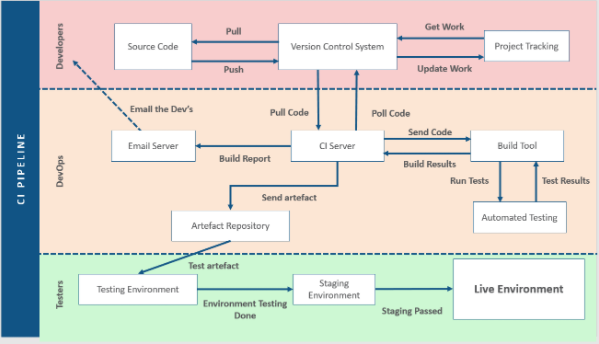

# DevOps 

**An important concept is automation. Automating builds, tests, and releases.**

- **Continuous Integration** – Integration of new features into software. 

- **Continuous Delivery** – Putting software into a staging environment before it’s tested. 

- **Continuous Deployment** – Deploying software to a customer/client. 

## Research Task 
***Research examples of CI/CD tools at each stage of a CI pipeline.***

## Software Used 

### Cloud Build

- Executes builds using Google Cloud Platform. 

- Can automate deployments. 

- Can import source code from: 

  - Google Cloud Storage 

  - Cloud Source Repos 

  - GitHub 

  - BitBucket 

### Container Registry

- Single place for a team to manage Docker images. 

- Can push an image to the container registry and pull from it. 

- Can define access control. 

### Cloud Source Repositories 

- Private Git repo hosted on Google Cloud Platform. 

- Can search through code across all repos. 

### GKE-on-Prem 

- Stands for “Google Kubernetes Engine”. 

- Allows access to IBM’s Kubernetes cloud service for data centres. 

- Manages and verifies installs and upgrades. 

- Google Cloud Console allows for a single view of all clusters across site and cloud environments. 

## Example CI Pipeline
