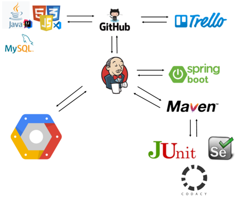
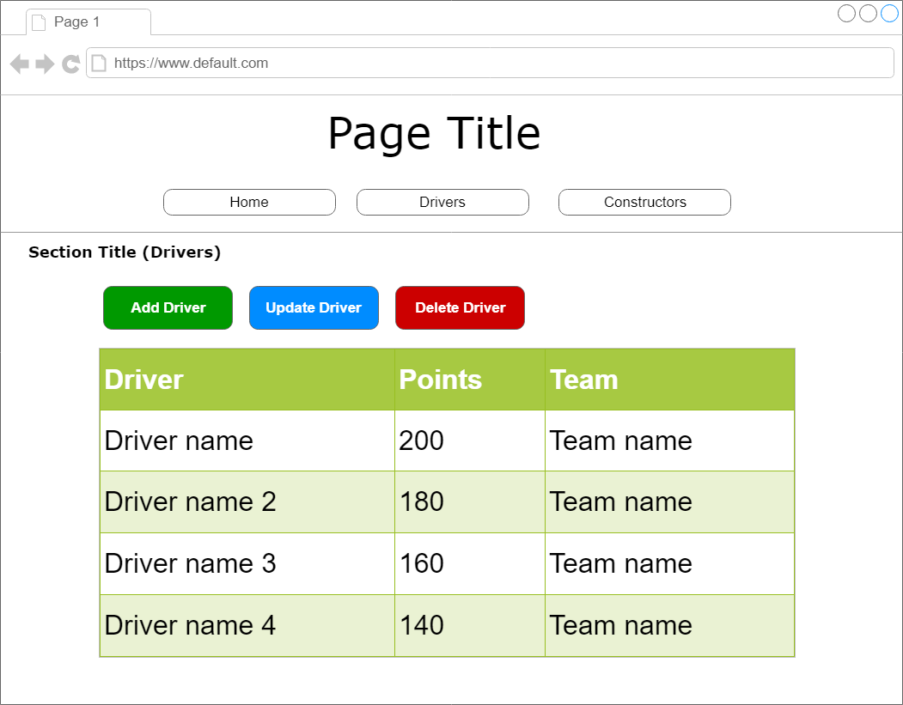
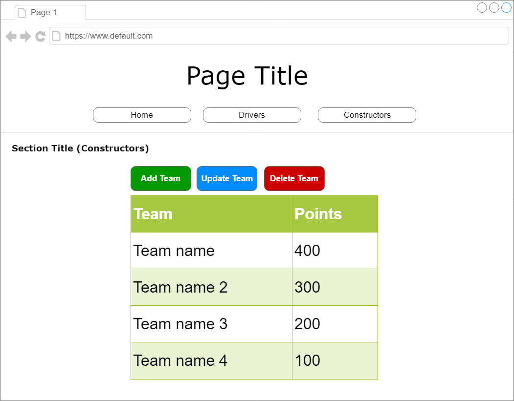

# QAC Individual Project

## Contents
[Brief](#brief)
  * [Scope](#scope)
  * [Solution](#solution)

[Front End](#frontend)  
[Testing](#testing)  
[Technologies Used](#techUsed)

## Brief
The overall objective of this project was:  
To create an OOP-based application with utilisation of supporting tools, methodologies and technologies that encapsulate all core modules covered during training. The application must include 2 database tables and full CRUD functionality.

## Scope
The project required that that the following be included as the MVP (Minimum Viable Product)  
  * A Trello board including user stories, use cases, tasks and issues.
  * A relational database with at least 2 tables.
  * A functional OOP application wiritten in Java including a functining front end website and integrated API's.
  * Test suites with automated testing. Backend tests must have 80% coverage and provide consistent reports.
  * Intergration into a Version Control System (Git) which will be built through a CI server (Jenkins) and deployed     using a cloud provider (GCP).

## Solution
My solution was to create an application that displays the current Driver's and Constructor's standings for the current Formula 1 season.  
The front end website displays a leaderboard of either drivers or constructors, depending on which button is clicked. The information is pulled from a database using an API written in Java.    
A user is able to create a record for a driver or team, update a driver or team's points, and remove a driver or team.

## Testing
Unit testing was performed using JUnit, automated testing was performed with Selenium.  
Static reporting was performed using Codacy, the results of which can be viewed here:  
[Main project](https://app.codacy.com/manual/mltomlins0n/QAProject/issues/index)  
[Unit testing (Back End)](https://app.codacy.com/manual/mltomlins0n/qaProjectSpring/issues/index)  
[Selenium](https://app.codacy.com/manual/mltomlins0n/qaProjectSelenium/dashboard)

## Technologies Used

  * [Trello](https://trello.com/b/A4EG5xwg/individual-project)
  * Git, GitHub
  * IntelliJ
  * VSCode
  * MySQL
  * Jenkins
  * Spring Boot
  * Maven
  * JUnit
  * Selenium
  * Codacy
  * Google Cloud Platform
  

## Front End
### Wireframes
### Drivers Page

### Constructors Page

